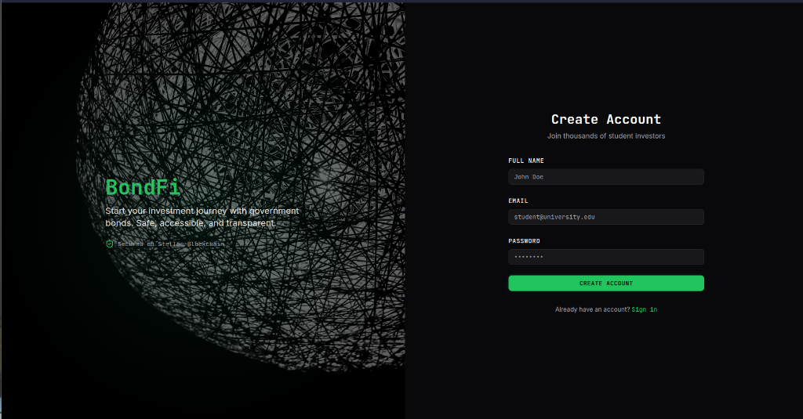
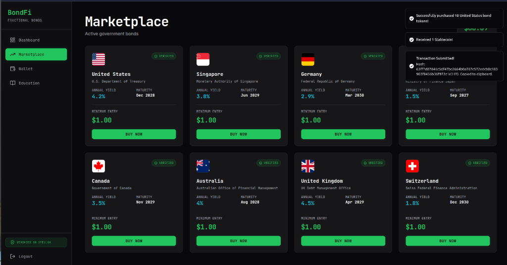
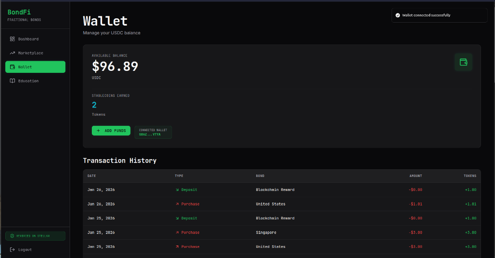

# BondFi

[](https://stellar.org)
[](https://soroban.stellar.org)
[](https://reactjs.org)
[](https://www.python.org)

A decentralized application (DApp) designed to provide fractional ownership of government bonds. This platform leverages blockchain technology to make high-value financial assets accessible, transparent, and liquid for all investors.

---

## 🚀 Key Features

* **Fractional Ownership:** Break high-entry government bonds into affordable digital tokens.
* **On-Chain Yield:** Automated interest distribution directly to user wallets via smart contracts.
* **Instant Liquidity:** Trade bond fractions 24/7 on a decentralized exchange.
* **Transparency:** Publicly verifiable proof of the underlying real-world assets.
* **Low Barriers to Entry:** Start investing with small amounts of stablecoins.

---

## 📸 Screenshots

### Registration


### Marketplace(Transactions)


### Wallet


### Dashboard


### Government Bonds


---

## 🛠️ Tech Stack

### Frontend
* **Framework:** React.js / Next.js
* **Styling:** Tailwind CSS
* **Wallet:** Stellar-compatible wallet (e.g., Freighter)

### Backend
* **Language:** Python (Flask or FastAPI)
* **SDK:** Stellar SDK

### Blockchain
* **Network:** Stellar
* **Smart Contracts:** Soroban (Rust)
* **Asset Standard:** Stellar Assets / SEP-20

---

## 📜 Smart Contract Information

The issuance logic and payout distributions are managed by the Soroban smart contract.

> **Contract Address: CDLQE2E5A2XVRJOCSS3VUCZXDYCO33PWSR36LLOKLUWJPQPA4V2YSW4T** > ` `  ---

## 📂 Project Structure

```text
├── backend/            # API for off-chain services and user data
├── frontend/           # React/Next.js client application
├── smart-contracts/    # Soroban Rust contracts for bond logic
└── docs/               # Technical documentation and architecture
